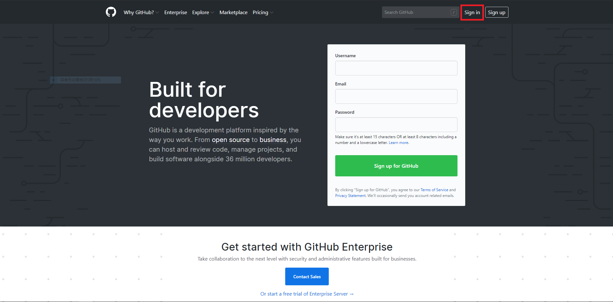
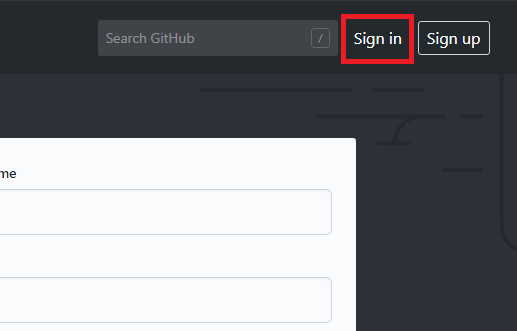
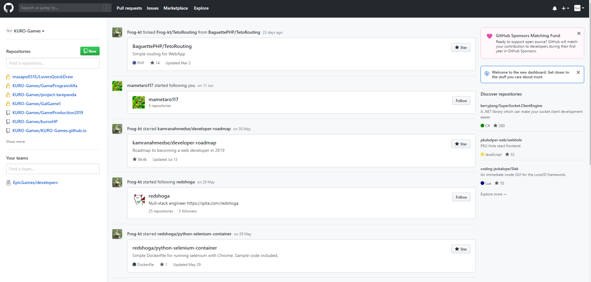
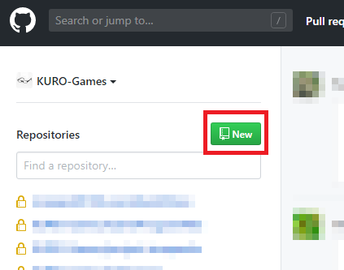
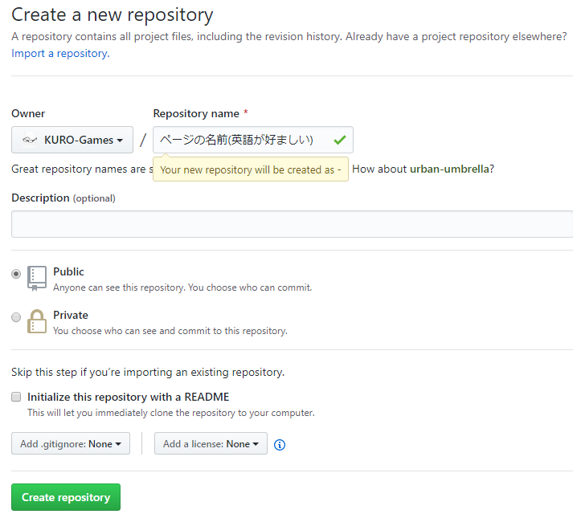
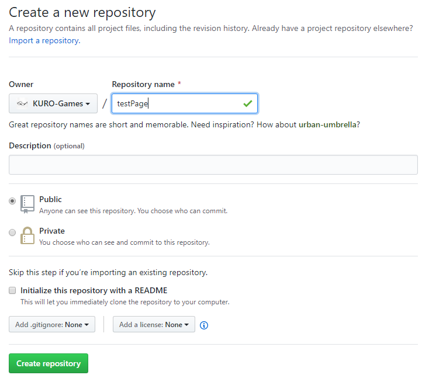
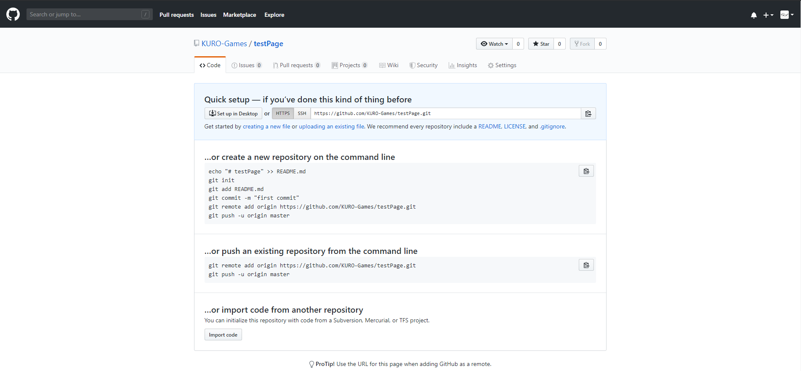

# GithubPages
  
さて、自分のホームページを作りたいけど、サーバーなんて弄ったことがない、Apache？Nginx？ ナニソレオイシイノ？っていう方に一番おすすめしたいのがこのGithubを使用して静的なページを公開できる、**GithubPages**です。

## 簡単な概要
GithubPagesのページは index.html で初期ページに設定できます。フォルダーはリポジトリ―毎に設定できるので、フォルダー分けをするときは、新規のリポジトリを作りましょう。  
また、デフォルトフォルダーは、 ’自分のアカウント名’.github.io という名前でリポジトリを作ると使えるようになります。

## GithubPagesの作り方
じゃあ早速作り方を紹介しようと思います！

### 1.Sign In(ログイン)する
まず、自分のリポジトリを作るためログインをします。
(おそらくこのページを見ている大抵の人はGithubアカウントを作っていると思うので、新規登録は省略します。)
  
  
### 2.レポジトリを作る
サインインができました。  
  
それではリポジトリを作っていきます。  
左上にある **NEW**をクリックして下さい。  
  
おそらくこんな画面が出てきたと思います。  
  
リポジトリの名前は**なるべく英語で**作るようにしましょう。  
またルートフォルダを作りたい方は’自分のアカウント名’.github.io にしましょう。  
今回は**testPage**というフォルダーを作ろうと思います。  
注意点は**パブリックリポジトリ**にしてください。表示できなくなります。  
書けたらCreate Repositoryを押します。  
  
リポジトリができました。  
  
### GithubPagesを設定する

