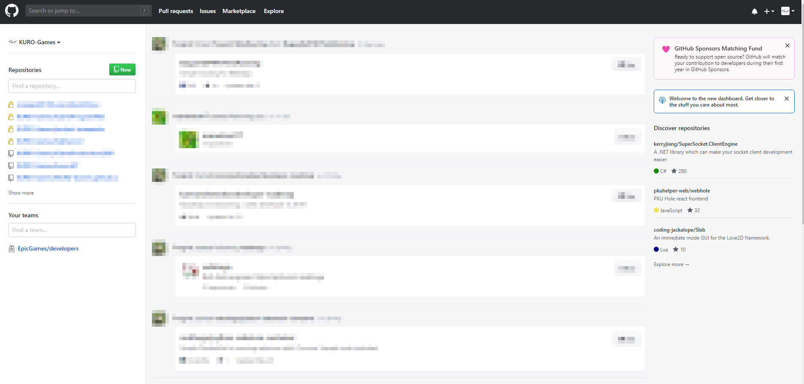
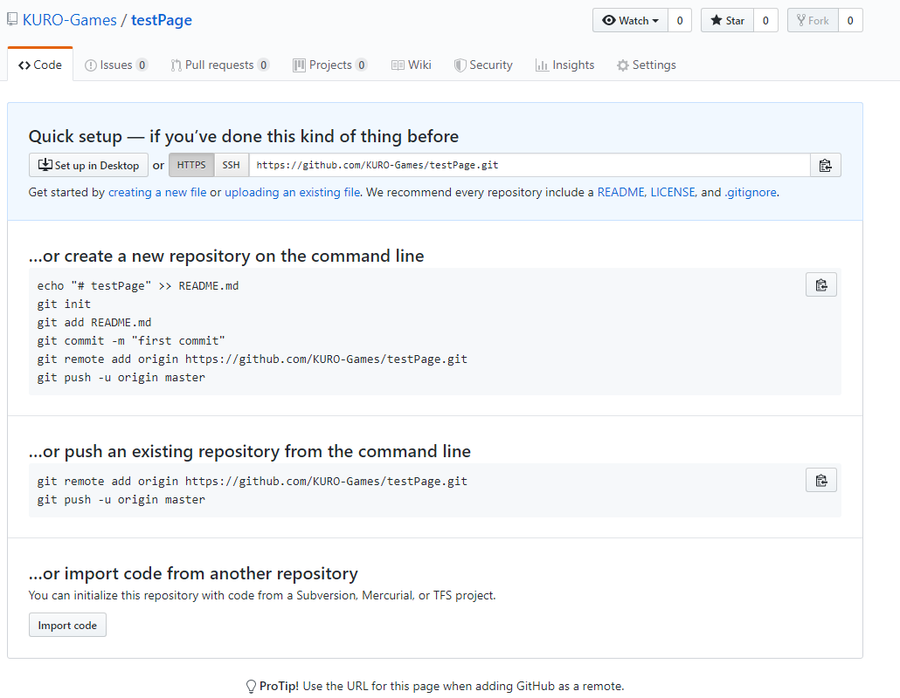
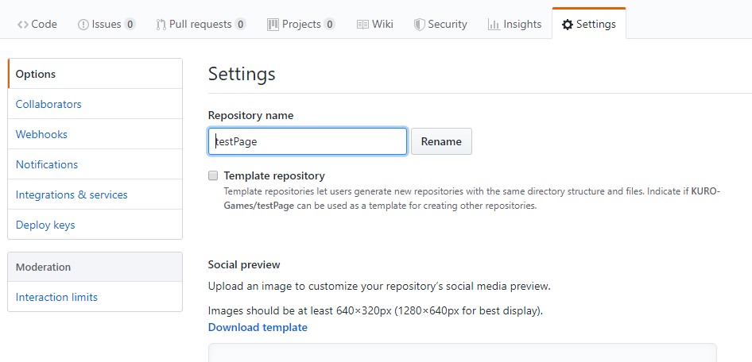
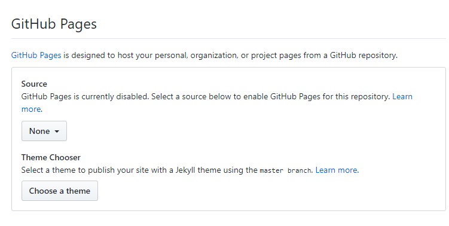
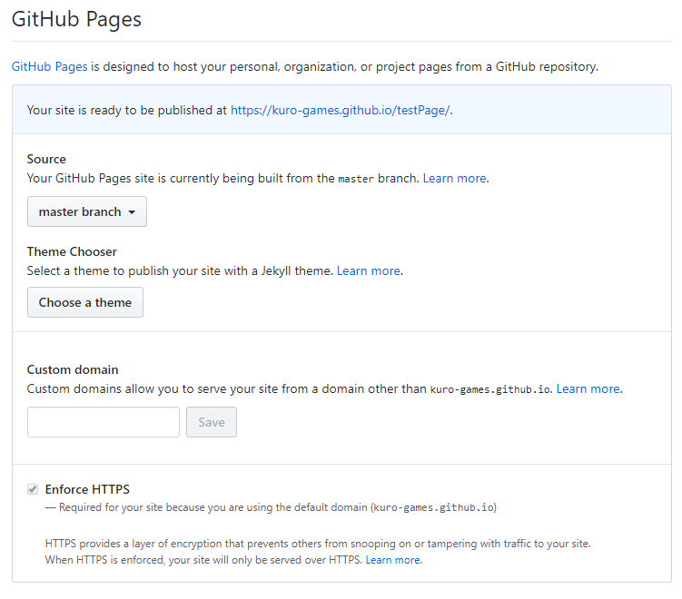

# GithubPages
  
さて、自分のホームページを作りたいけど、サーバーなんて弄ったことがない、Apache？Nginx？ ナニソレオイシイノ？っていう方に一番おすすめしたいのがこのGithubを使用して静的なページを公開できる、**GithubPages**です。

## 簡単な概要
GithubPagesのページは index.html で初期ページに設定できます。フォルダーはリポジトリ―毎に設定できるので、フォルダー分けをするときは、新規のリポジトリを作りましょう。  
また、デフォルトフォルダーは、 ’自分のアカウント名’.github.io という名前でリポジトリを作ると使えるようになります。

## GithubPagesの作り方
じゃあ早速作り方を紹介しようと思います！

### 1.Sign In(ログイン)する
---
まず、自分のリポジトリを作るためログインをします。
(おそらくこのページを見ている大抵の人はGithubアカウントを作っていると思うので、新規登録は省略します。)
  
  
### 2.レポジトリを作る
---
サインインができました。  
  
それではリポジトリを作っていきます。  
左上にある **NEW**をクリックして下さい。  
  
おそらくこんな画面が出てきたと思います。  
  
リポジトリの名前は**なるべく英語で**作るようにしましょう。  
またルートフォルダを作りたい方は’自分のアカウント名’.github.io にしましょう。  
今回は**testPage**というフォルダーを作ろうと思います。  
注意点は**パブリックリポジトリ**にしてください。表示できなくなります。  
書けたらCreate Repositoryを押します。  
  
リポジトリができました。  
  
### 3.リポジトリにソースをコミットする
---
リポジトリにソースが無い状態だとGithubPagesの設定が出来ないため、簡単なソースをコミットします。  
今回は下記のような簡単なものを作りました。  
~~~  
<html>  
    <body>  
        
<h1>Hello Github Pages</h1>
  
    </body>  
</html>  
~~~  
  
はい、いつものHelloWorldです。  
とりあえず、このソースコードの名前を**index.html**にして、コミットします。  
今回はSourceTreeを使いました。  
  
  
コミットが完了しました。  
  
  
今回のコードは、sampleの中に入れています。  
  
### 4.GithubPagesを設定する
---
前回、コードをコミットしたので、GithubPagesを設定していきます。  
GithubPagesの設定は、**Settings**の**Options**の下の方にあります。  
  
  
今回は直下にindex.htmlファイルを置いているので、SourceのNoneのタブを開いて、master branchを選択します。
  
下の青い通知が出てきたら、設定は終了です。  
  
  
### 5.公開したページを見てみる
---
では、公開したページを見てみましょう。  
先程設定したGithubPagesの設定を見ましょう。
おそらく、  
'Your site is ready to be published at https://(アカウント名).github.io/(リポジトリ名)'  
のURLが出ていると思います。  
  
それではURLをクリックしてみましょう。  
ページが表示されたら完成です。  
  
  
---
## 終わりに...
GithubPagesの容量は、基本的にはなく(1GBを超えるとメール通知が来るらしい)、リポジトリ毎にGithubPagesも設定でき、なおかつ、ソース管理もできるので、ぜひ皆さんで広めていきましょう！
